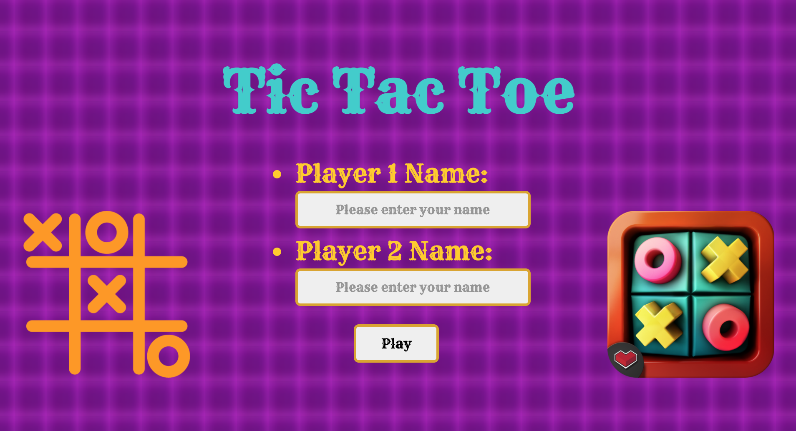
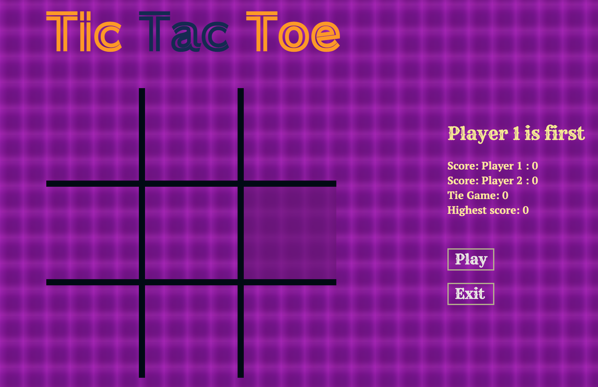

Tic Tac Toe
=========
## Introduction

This Tic Tac Toe Project is a 3x3 game. The goal of this project was to create a Tic-Tac-Toe board which is able to monitor the state of a game and return the win/loose/draw state of the game after each player’s move. Specifically, for each player’s turn, the game records the player’s inputs and at the end of the game determines if the game is done and who the winner is and record the score. The game allows two players to play against each other. Each of the nine spaces can be “X”, “O” or blank.

### How to play

#### Players details
When the game is loaded, you need to enter name for player 1 and Player 2. Once ready click on play button. You can also select emoji 🐻👨‍🏫and use it as Player ID. If user input not provided that the default one is Player 1 and player 2.
#### Player 1 versus Player 2.
You just need to click in a position in the board to have the given player to play it. The current player will be highlighted on right hand side of the screen.
#### Game over:
Once the game has a winner or there is a draw, you will see a screen about the result. From here you can:

* Repeat the game with the same players selection.
* Start a new game.

#### score:
Scores for each player will be recorded. Highest score with player name would also get recorded.

#### Technology:

Used Javascript, HTML, CSS and JQuery for DOM manipulation.

#### Folder Structure

Started by building the user interface so we have something to look at while building the game logic.

We have four folders in total and two files inside Project0:

1.  ___index.html___ (will hold our UI structure and import the other files we need)

2. ___css/style.css___(to make our game look decent)

3. ___js/project.js___(to hold our game logic, and handle everything else we need)

4. ___images___ (to store all images that are used for project)

5. ___Audio___ (to store audio clips here)

6. ___README.md___(User Guide and all details about Tic Tac Toe project)

### Game display:

This is how game will display:

* Screen One - Takes user name or emoji as player ID

* Screen Two - Enjoy playing your TIC TAC TOE.

